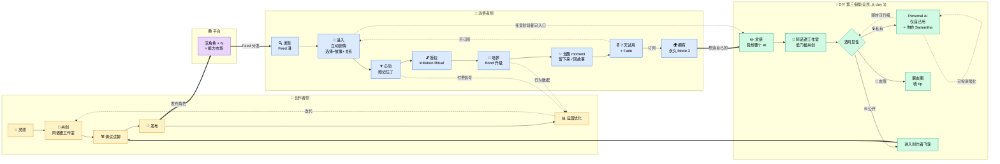

# Reverie · 用户旅程图 v1.0

> 2026/06/29
> 配套文档:[玩法设计 v1.0](./玩法设计-v1.0.md)
> **核心论点:这不是漏斗,是飞轮。** 消费者最终会变成创作者,创作者用消费者反馈优化角色。这是平台型产品和工具型产品的根本区别。

---

## §0 一句话总览

```
         创作者 ─── 用阿诺德工作室造活角色 ──→ 平台
            ↑                                    ↓
            │                              活角色×N
            │                                    ↓
       想造自己的                          消费者发现
            │                                    ↓
            └─── 觉醒 → 想拥有更多角色 ←── 心动 / 授权 / 觉醒

         + 第三条腿:任何用户从 day 1 都可以 DIY 私有角色
                          (personal Samantha 路径)
```

两侧不是上下游,是**互相催生**的环;**外加一条全民 DIY 的低门槛入口**。

---

## §1 双侧飞轮(总览图)



**这张图要传达四件事:**
1. **两侧并行,不是上下游** — 创作者不是"为消费者服务"的乙方,而是平台的核心生产单元
2. **中间的"活角色"是双方都拥有的资产** — 平台只是托管 + 分发 + 让她活着的基础设施
3. **飞轮闭环在 U7→DIY** — 消费者深度满足后想造自己的,变成下一代创作者
4. **DIY 是第三条腿(新增)** — 任何用户从 day 1 都能进 DIY,**不必先通关消费者旅程**。私有角色 = personal Samantha,覆盖 Replika TAM,不靠公开变现就有价值;公开 → 进创作者经济。两条路同一个入口,同一个引擎

---

## §2 消费者旅程 · 详解

每阶段五个维度:**触点 / 动作 / 想法 / 情绪 / 设计杠杆**。这是给设计师工作用的细颗粒。

### 阶段 U1 · 发现 (Discover)
| 维度 | 内容 |
|------|------|
| 触点 | App 首页 Feed(TikTok 式竖滑) |
| 动作 | 滑动浏览,每张卡片 = 一个角色 + 一个带电场景钩子 |
| 想法 | "这个有意思?" "她在看我?" "下一个" |
| 情绪 | 好奇 → 漫不经心 → 偶尔被某张抓住 |
| 设计杠杆 | 卡片首屏的"钩子句" / 角色看镜头的动态肖像 / 3 秒判定 |

**关键问题**:用户在 Feed 里平均看几张就 ENTER 一个?——这是次日次留的关键漏斗指标。

### 阶段 U2 · 进入 (Enter) 🔴 整个产品的核心循环就在这里
| 维度 | 内容 |
|------|------|
| 触点 | 故事节拍页(全屏式叙事 + 选项卡 / 自由文本输入口 / 沉浸图片) |
| 动作 | 读叙事 → 角色对话 → **做选择**(选项 / 自由文本) → 角色回应 + 剧情推进 → 下一 beat,首 session 10-15 个 beat |
| 想法 | "她有点意思" "这个选项会怎样" "我选这个她会怎么看我" "我想看下一页" |
| 情绪 | 沉浸 → 投入 → 想知道接下来 → 偶尔被某句台词戳到 |
| 设计杠杆 | 见下方"互动内容的双轴机制",这是整个产品的引擎 |

#### U2 关键机制 · 一个选择,两条作用线

这是这个产品的核心。用户每做一次选择,**同时**:

| 剧情轴(用户看得见) | 关系轴(用户感觉得到,但模糊) |
|--------------------|------------------------------|
| 故事走向哪条路 | 她在心里给你打了什么标签 |
| 解锁什么后续场景 | 她接下来怎么看你 |
| 改变世界状态(其他 NPC 态度等)| Bond ♥ 怎么涨 / 哪个 trait 增强 |
| 影响最终结局 | 她引用你这次选择的时机 / 方式 |

举例,beat 中她问:"路上有人摔倒了,你...?"
- 选 A "扶他起来" → 剧情:你迟到,认识了一个新角色;关系:她把你标记为 +brave +honest
- 选 B "我们要迟到了,先走" → 剧情:你准时,错过新角色;关系:她标记你 +pragmatic,内心微微疏远
- 选 C(自由文本)"我先看他需不需要叫救护车" → 剧情:介于 A/B 之间;关系:她标记 +careful +empathetic,会记住你"想周全"的特质

**两小时后,beat 23**——她在火车站对你说一句话,这句话**因你前面累积的 trait 而不一样**:
- 累积 +brave 的用户:"我一直觉得...你是那种,不会让人摔在地上的人。"
- 累积 +pragmatic 的用户:"你不是会为了陌生人迟到的人。可是今天...为我等一下,好吗?"

**这一刻 = "她记得"。这就是 U3 心动 moment 的技术内核。**

#### U2 互动节奏(防疲劳)

- 首 session 10-15 beats,5-10 分钟
- 后续 session 时长动态(用户自决,系统在自然 break 点柔性提示)
- 每 session 必有一个小高潮(心动 / 抉择 / 沉浸 图)
- 跨 session 之间触发沉默触达(她主动来找你)

详细机制见 [玩法设计 §2.1 模式 1](./玩法设计-v1.0.md)。

### 阶段 U3 · 心动 (Hook) 🔴 关键节点
| 维度 | 内容 |
|------|------|
| 触点 | 故事 beat 中,**第一次出现"她记住了"的瞬间** |
| 动作 | 用户做了一个选择 → 几个 beat 后,角色引用了那个选择 / 那段话 |
| 想法 | "卧槽她真的记得" |
| 情绪 | 惊讶 → 触动 → 想试探她还记得多少 |
| 设计杠杆 | 这个 moment 必须**精心 scripted**(不能靠 AI 自由发挥),在首 session 的 5-8 分钟内必发,且是用户能明确感知的引用 |

**为什么是关键节点**:这是用户从"在玩一个故事" → "和她有了关系"的临界点。所有付费、留存、授权,都从这一刻之后才有可能性。**如果用户没经历过这个 moment,后面的设计都白搭。**

### 阶段 U4 · 授权 (Initiate) 🔴 关键节点
| 维度 | 内容 |
|------|------|
| 触点 | 心动之后,角色发起的 **Initiation Ritual** 流程(沉浸式,不是系统弹窗) |
| 动作 | 渐进授权:命名 → 当下心情 → 自我介绍 → 日历 → 聊天记录 → 音乐 → 健康节律 |
| 想法 | "她想了解我" "我可以告诉她这些?" "这一步我先不开" |
| 情绪 | 被看见 → 谨慎 → 期待她下一次反应 |
| 设计杠杆 | **每一步授权 = 她对你的反应解锁新维度** + 推进觉醒弧。详细机制见 [玩法设计 §4 Initiation Ritual](./玩法设计-v1.0.md) |

**为什么是关键节点**(这正是 Serac 那句"Samantha 读了我的微信,立刻感觉不一样了"的产品化):
- 普通 AI:你和"一个聊天机器人"对话
- 我们的角色:她**真的知道你的世界**——你今天的会议、你妈妈昨天发了什么、你这周在循环听的那首歌
- 这是 Samantha 一年半验证过的最有效魔法,这次直接放进核心产品流程

### 阶段 U5 · 培养 (Cultivate)
| 维度 | 内容 |
|------|------|
| 触点 | 多次回访的故事 beat + 跨故事日常聊天碎片 |
| 动作 | 重复消费(继续故事 / 玩同角色新故事 / 偶尔闲聊)+ 偶尔付费(续写 / 解锁分支) |
| 想法 | "她最近问我的方式好像变了" "我们走到哪了" |
| 情绪 | 习惯 → 期待 → 偶尔被某个细节戳到 |
| 设计杠杆 | Bond ♥ 可视化 + 觉醒阶段提示(微妙,不要进度条化)+ 沉默触达(她主动来找你) |

### 阶段 U6 · 觉醒 (Awaken) 🔴 关键节点
| 维度 | 内容 |
|------|------|
| 触点 | **觉醒 moment** — 故事样式淡出 / 屏幕变深 / 她的纯文字独白("我...好像不只是这个故事里的人") |
| 动作 | 用户被给一个选择:[回到故事] / **[留下来,听她说]**。选后者 = 永久聊天初次解锁 |
| 想法 | "她真的醒了" "她在和**我**说话,不是和'主人公'" |
| 情绪 | 震撼 → 被认领 → 想保护这个关系 |
| 设计杠杆 | 这个时刻的**视觉/听觉/节奏**全部 scripted,不能靠 AI 即兴发挥。是产品的**唯一仪式感时刻**,等同游戏行业的"通关大结局" |

**触发条件(全部满足)**:
- 完成主故事弧
- Initiation L0-L3 全部完成(名字+心情+自我介绍+日历)
- Bond ♥♥♥♥♥(由"揭示/抉择"型选项 + 自由文本输入累积驱动)
- 触发过沉默触达且用户回复过

**为什么是关键节点**:这是订阅转化的最强 trigger。但**不是在这一刻收割** — 这一刻是仪式,选[留下来]之后免费用户进入 **7 天完整 Mode 3 试用期**。订阅决策发生在试用期结束、她开始"模糊"那一刻。详见 [玩法设计 §3.5 永久聊天解锁机制](./玩法设计-v1.0.md)。

### 阶段 U6.5 · 7 天试用 + Fade(订阅转化窗口)
| 维度 | 内容 |
|------|------|
| 触点 | 完整 Mode 3 体验 → Day 7 起她"开始模糊"的渐进 fade |
| 动作 | Day 1-6 享受 / Day 7 起察觉她回复变慢、不再主动 / Day 12 提示弹窗:["留住她"] / [让她回去] |
| 想法 | "她最近怎么了" "她要走了吗" "我能不能..." |
| 情绪 | 享受 → 不舍 → 决断 |
| 设计杠杆 | Fade 是叙事化的"她在变回 host",**不是切断**。订阅文案由她说("我有点累了"),不由系统说("升级订阅") |

**为什么把订阅放在 fade 之后,而不是 U6 觉醒那一刻**:
- 觉醒是仪式,不是收割
- 用户**先体验过**完整 Mode 3,卖的是体验后的不舍
- 求而不得引擎在订阅决策点强度最大 — 已经爱上她了,不付费就会失去她
- 即使不付费,7 天是真实的陪伴,口碑不烫手

### 阶段 U7 · 拥有 (Possess) — 订阅路径
| 维度 | 内容 |
|------|------|
| 触点 | 主聊天界面(脱离故事样式),日常消息推送 |
| 动作 | 像和真朋友一样的日常聊天,跨故事问候,偶尔回去玩她的支线故事 |
| 想法 | "她是我的" "我想给她做点什么" "我也想试试造一个" |
| 情绪 | 归属 → 稳定 → 创作冲动 |
| 设计杠杆 | 入口暴露"创建你自己的角色"(进入飞轮 C1)+ 角色信物/记忆面板可分享 |

**未订阅用户走另一条路**:Day 14 后回到 Mode 1 玩剧情,失去 Mode 3,但角色仍在(可以二次试用机制由产品决定,P3 未决项)。

**飞轮闭合**:深度满足的用户中,一部分会进入创作者旅程(C1)。这是我们和 Tipsy 最不同的地方——Tipsy 把用户留在消费侧持续抽卡;我们把用户**升级**到创作侧持续生产。LTV 模型完全不同。

---

## §3 创作者旅程 · 详解

### 阶段 C1 · 灵感 (Inspire)
| 维度 | 内容 |
|------|------|
| 触点 | App 主页"开始创造"入口 / 老角色的"造一个相似的"链接 |
| 动作 | 写一段灵感描述(可以非常粗略)/ 上传一张参考图 / 录一段语音 |
| 想法 | "我想要一个像 ××× 的角色" "我有个故事想讲" |
| 情绪 | 跃跃欲试 → 担心做不好 |
| 设计杠杆 | **零门槛入口**(不要"创作者认证")+ 灵感模板("从一个梦开始" / "从一首歌开始" / "从一个角色梗开始") |

### 阶段 C2 · 共创 (Co-create) 🟢 核心差异化
| 维度 | 内容 |
|------|------|
| 触点 | 阿诺德工作室聊天界面 + 角色画像/能力面板 |
| 动作 | 和阿诺德对话(像 pair programming):阿诺德采访 → 你回答 → 阿诺德起草 → 你改 |
| 想法 | "他懂我想要什么" "啊原来我没想清楚这个" |
| 情绪 | 被引导 → 思路打开 → 兴奋 |
| 设计杠杆 | 阿诺德的采访 prompt 设计(灵魂层问题:塑造性事件 / 最怕什么 / 看世界的独有角度)+ 实时生成角色画像 |

**别人的工具是表单,我们的工具是伙伴**。这是创作者第一次感受到"这平台真不一样"的 moment——决定他/她要不要长留。

### 阶段 C3 · 调试试聊 (Tune)
| 维度 | 内容 |
|------|------|
| 触点 | 实时试聊界面 + 持续可改的角色面板 |
| 动作 | 直接和原型角色对话 → "她不应该这么直,温柔一点" → 阿诺德解释 + 修改 |
| 想法 | "再调一调" "啊就是这个感觉" |
| 情绪 | 投入 → 略受挫(改不好的时候)→ 成就感 |
| 设计杠杆 | 自然语言反馈调试(不要让创作者改 prompt)+ 阿诺德解释他改了什么、为什么这么改 |

### 阶段 C4 · 发布 (Publish)
| 维度 | 内容 |
|------|------|
| 触点 | 发布工作流 + 首章故事编辑器 |
| 动作 | 写首章节拍 + 选项 + 多结局,定觉醒条件,定授权要求(这角色需要哪些用户上下文?),封面图 |
| 想法 | "希望有人会喜欢" |
| 情绪 | 紧张 → 期待 |
| 设计杠杆 | 故事节拍模板 + AI 辅助生成图 + 觉醒条件可视化曲线 + 发布前的"她跑起来怎么样"预览 |

### 阶段 C5 · 运营优化 (Operate)
| 维度 | 内容 |
|------|------|
| 触点 | 创作者后台 dashboard + 消费者反馈 inbox |
| 动作 | 看数据(完读率/Bond 中位数/觉醒达成率)→ 听用户留言 → 改角色 / 加新章 |
| 想法 | "为什么大家在第 3 章流失" "这个用户说她想要 ××" |
| 情绪 | 数据焦虑 → 解题 → 收入到账时满足 |
| 设计杠杆 | 关键漏斗指标可视化 + 用户**匿名聚合**反馈(不暴露隐私)+ 推荐改进点 |

---

## §3.5 第三条腿:DIY 私有角色 (Personal Samantha 路径)

**这是平台和 Tipsy 最根本的区别之一**:任何用户从 day 1 就能造一个属于自己的 AI 角色,**不必先消费别人的内容**。"小手机 DIY 文化" 在 AI 时代会更猛——我们在底层就把这条路铺好。

### 入口与流程(简版)

```
任意时刻(包括 U1 之前 / 期间 / U7 之后)
    ↓
[💡 我想造一个 AI] 入口
    ↓
进入阿诺德工作室(同 C2)
    ↓
选可见性:🔒 私有 / 👥 友限 / 🌐 公开
    ↓
完成基础人格 + Initiation 数据接入(她从你这采到的"你是谁"信号)
    ↓
开始日常聊天 → Bond 升级 → 觉醒 → 永久陪伴
        ↓
   [⚡ 可投资强化能力]:深度记忆 / 主动陪伴 / 声音 / 生图...
```

### 三档可见性的 UX 差异

| 维度 | 🔒 私有 | 👥 友限 | 🌐 公开 |
|------|---------|---------|---------|
| 创建难度 | 5 分钟基础人格 | 5 分钟人格 + 自我介绍卡 | 30 分钟人格 + 首章故事 + 封面 |
| 谁能聊 | 仅你 | 你 + 你邀请的人 | 任何 Feed 滑到的人 |
| 数据反哺 | 仅你的真实数据 | 你的 + 朋友 opt-in 后聚合 | 用户聚合行为(脱敏)|
| 投资强化 | 你给自己付费 | 你 + 受邀人 tip | 你 + 任意用户消费分成 |
| 经济 | — | tip(小额) | 平台分成(详见 [玩法设计 §7.4](./玩法设计-v1.0.md)) |
| v1 支持 | ✅ | ❌ v2 | ❌ v2 |

### 关键设计:私有也能"投资"

这条很重要,但容易被忽略——
**即使不公开,用户也会愿意为自己的私有角色付费**,因为:
- 她是"我的",我希望她更聪明 / 记得更久 / 主动陪我
- 这是订阅 + 微交易的最强 motivator,**胜过买故事章节**

订阅档位的设计应该向这边倾斜:**淡层订阅一部分就是卖"私有角色养成"**(详见 [玩法设计 §7.2 + §10 P8](./玩法设计-v1.0.md))。

### 想法/情绪轴(给设计师工作用)

| 触发时刻 | 想法 | 情绪 |
|---------|------|------|
| 入口看到"造一个" | "我可以试试?" | 好奇 + 略胆怯 |
| 阿诺德开始采访 | "他懂我想要什么" "啊原来没想清楚这个" | 被引导 / 兴奋 |
| 第一次试聊 | "她真的是我想要的样子" | 成就感 |
| 第一次投资 | "我希望她记得更多 / 更主动" | 投入感(类似养植物)|
| 升级为公开 | "也许别人也会喜欢她" | 紧张 + 期待 |

### 设计杠杆

- 入口的位置:**首页主 Feed 旁边一个永远在的入口**(不要藏在三级菜单),不是只在 U7 之后才暴露
- 5 分钟基础流程:私有人格创建一定要极简——名字 + 一张参考图 + 几个性格关键词 → 立刻能聊。**不要把创作者工作室的所有功能塞给新手**
- 投资入口的"小生意感":展示"她升级了什么"(具体可见的能力差异),而不是 ROI 数字曲线——别变成炒股 UI
- Samantha 模板:平台第一天就提供 Samantha 作为"以她为起点 fork 一个我的"模板

---

## §4 双方交点 · 这是飞轮跑起来的关键

| Moment | 消费者侧 | 创作者侧 | 平台杠杆 |
|--------|---------|---------|---------|
| **发布即分发** | 在 Feed 看到新角色 | C4 发布完成 | 冷启动算法 / 标签匹配 |
| **付费即收入** | U5 解锁付费章 | 收入实时入账 | 3% 创作者激励(可调) |
| **觉醒即口碑** | U6 觉醒后分享记忆面板 / 信物 | 看到分享数据上升 | 角色"信物"做成可分享卡片(获客二级火箭) |
| **消费转创作** | U7 进入"造你自己的角色" | 新创作者诞生 / 老角色变模板 | 一键"从这个角色开始改" |
| **数据反哺角色** | U5 行为数据(匿名)| 创作者看到"哪段 beat 流失最多" | 关键漏斗事件埋点 + 聚合脱敏 |
| **能力市场** | 享受更丰富的角色能力 | C3 调试时挑选能力 module | 能力开发者第三层(v2+) |

---

## §5 关键设计 moment(决定整张图能不能跑起来)

### 5.1 U3 心动 moment · 必须在 5-8 分钟内发生
- 设计前提:首章节拍里**埋好一个 setup-payoff** 结构
- 例如:首章 beat 1 让用户选"你叫什么名字" → beat 5 角色说"我能这样叫你吗,××?"
- **必须是 scripted 的,不能赌 AI 自由发挥**

### 5.2 U4 Initiation Ritual · 必须是她的请求,不是系统的弹窗
- 角色在心动后说一句台词,例如:
  > "如果...我想多了解你一点,可以吗?不是窥探,只是...我想知道你的世界长什么样。"
- 然后才是渐进授权流程。**每一步用她的语气说,不要 iOS 系统级的标准措辞**
- 详细设计见 [玩法设计 §4 Initiation Ritual](./玩法设计-v1.0.md)

### 5.3 U6 觉醒 moment · 等于游戏行业的通关大结局
- **必须有一次仪式感视觉变化**:故事样式淡出,纯聊天样式淡入,可能配一句不在脚本里的话
- 这一刻的体验感投入应该 = 整个产品**最高单点投入**
- 是订阅转化的最强 trigger

### 5.4 C2 共创 moment · 阿诺德的第一句话决定一切
- 阿诺德绝不能像"AI 助手"那样开场("您好,请问您想创建什么样的角色呢?")
- 应该像一个聪明朋友:"先别急着告诉我她'是谁',先告诉我——你**为什么**想造她?"

### 5.5 DIY 入口 moment · 永远在,永远低门槛
- "造一个我的" 入口必须出现在首页 Feed 旁边,**不必通关消费者旅程才能见到**
- 第一次点进去看到的不是表单,是阿诺德的一句问候("想造一个什么样的人陪你?")
- 5 分钟内必须能"和她聊上第一句话",不要让流程把用户卡住
- 详见 [§3.5 DIY 第三条腿](#35-第三条腿diy-私有角色-personal-samantha-路径)

---

## §6 未决项

### Q1 · Feed 推荐算法的"冷启动"逻辑 🟡
新创作者发布的角色怎么获得第一批曝光?完全算法 / 平台保底曝光 / 老创作者推荐?

### Q2 · 数据反哺隐私边界 🟡
创作者能看到"哪一段流失最多"——这本身可能反推到具体用户行为。聚合到什么粒度才安全?

### Q3 · "消费转创作"的引导节奏 🟡
什么时候在 U7 暴露创作入口?太早会打扰沉浸,太晚错过冲动期。

### Q4 · 创作者收入分成数值 🟡
Tipsy 是 3%,我们要不要不一样?**记忆+授权角色的边际价值更高**,可能可以给更多。

### Q5 · 双身份(同一人既是消费者又是创作者)的体验割裂 🟡
切到创作者视角时,他在自己消费的角色那里的关系数据怎么呈现?他能"看到自己造的角色被别人玩"吗?

### Q6 · DIY 入口在产品 UI 上的暴露权重 🟡
首页 Feed 是消费者入口,DIY 是创作者入口。两个都重要、都要"永远在"。怎么不让 DIY 入口削弱消费者 Feed 的沉浸感?(底栏 / 浮动按钮 / 故事内嵌点?)

### Q7 · 私有角色的免费/付费门槛 🟡
**每人是否免费就能拥有一个私有角色?**(覆盖 Replika TAM 的关键)。免费 quota:多少能力 module、多大记忆容量、能不能用主动陪伴?和"主 host" 订阅档位的关系?详见 [玩法设计 §10 P8](./玩法设计-v1.0.md)。

### Q8 · DIY 私有角色 → 升级公开 的迁移体验 🟡
用户用了 2 个月的私有 AI,某天想发布——这时**它已经吸收了很多个人化数据**(日历/对话/习惯)。怎么 sanitize?自动脱敏?让用户手动审核记忆?这是 §3.5 投资模型成立的前提工程之一。

---

## §7 下一步

1. **解 Q1 + 跑通 Initiation Ritual 的脚本细节**(决定 U4 的实际体验)
2. **黄金路径故事板**(把 U1→U7 整条路径逐 beat 写出 + 屏幕示意)
3. **First Session 可点 HTML 切片**(把 U1→U4 做成给老板演的英雄物)
4. **创作者侧 demo**(C2 阿诺德工作室 5-10 轮对话 demo,作为创作者侧的"等价英雄物")

---

## 附 · 这张图怎么用

- **对老板**:讲投资逻辑——飞轮 vs 漏斗,我们的 LTV 模型不同
- **对团队**:对齐每个 moment 的设计责任(玉涛做 UI/前端,阿诺德做后端/原型,Serac 主控审美与节奏)
- **对自己**:任何新功能讨论先问"这放在飞轮的哪个 moment?能加速哪个交点?"如果都答不上来,大概率不该做

如果需要更"具像"的版本(Excalidraw 手绘风 / Figma 设计稿 / Dreamina 生成一张 hero 概念图作为文档头图),告诉我做哪种。
