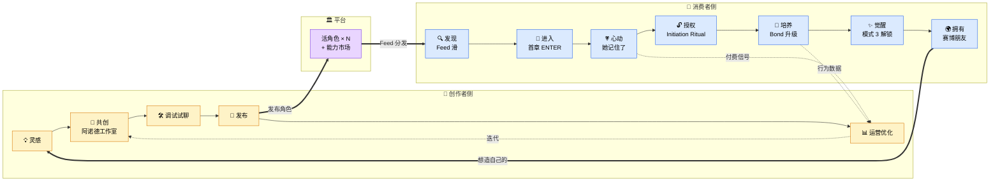

# Reverie · 用户旅程图 v1.0

> 2026/06/29
> 配套文档:[玩法设计 v1.0](./玩法设计-v1.0.md)
> **核心论点:这不是漏斗,是飞轮。** 消费者最终会变成创作者,创作者用消费者反馈优化角色。这是平台型产品和工具型产品的根本区别。

---

## §0 一句话总览

```
         创作者 ─── 用阿诺德工作室造活角色 ──→ 平台
            ↑                                    ↓
            │                              活角色×N
            │                                    ↓
       想造自己的                          消费者发现
            │                                    ↓
            └─── 觉醒 → 想拥有更多角色 ←── 心动 / 授权 / 觉醒
```

两侧不是上下游,是**互相催生**的环。

---

## §1 双侧飞轮(总览图)



**这张图要传达三件事:**
1. 两侧并行,不是上下游 — 创作者不是"为消费者服务"的乙方,而是平台的核心生产单元
2. 中间的"活角色"是**双方都拥有**的资产 — 平台只是托管 + 分发 + 让她活着的基础设施
3. 飞轮的闭环在 U7→C1 —— **消费者深度满足后想造自己的角色,变成下一代创作者**。这是 LTV 远高于 Tipsy 的根本

---

## §2 消费者旅程 · 详解

每阶段五个维度:**触点 / 动作 / 想法 / 情绪 / 设计杠杆**。这是给设计师工作用的细颗粒。

### 阶段 U1 · 发现 (Discover)
| 维度 | 内容 |
|------|------|
| 触点 | App 首页 Feed(TikTok 式竖滑) |
| 动作 | 滑动浏览,每张卡片 = 一个角色 + 一个带电场景钩子 |
| 想法 | "这个有意思?" "她在看我?" "下一个" |
| 情绪 | 好奇 → 漫不经心 → 偶尔被某张抓住 |
| 设计杠杆 | 卡片首屏的"钩子句" / 角色看镜头的动态肖像 / 3 秒判定 |

**关键问题**:用户在 Feed 里平均看几张就 ENTER 一个?——这是次日次留的关键漏斗指标。

### 阶段 U2 · 进入 (Enter)
| 维度 | 内容 |
|------|------|
| 触点 | 故事节拍页(全屏式叙事 + 选项卡) |
| 动作 | 读首章 → 选项 → 角色回应 → 下一 beat,3-5 个 beat |
| 想法 | "她有点意思" "这个选项会怎样" "我想看下一页" |
| 情绪 | 沉浸 → 投入 → 想知道接下来 |
| 设计杠杆 | 首章 beat 设计(必须有一个"小高潮") / 选项措辞 / 第一次自由文本输入口的时机 |

### 阶段 U3 · 心动 (Hook) 🔴 关键节点
| 维度 | 内容 |
|------|------|
| 触点 | 故事 beat 中,**第一次出现"她记住了"的瞬间** |
| 动作 | 用户做了一个选择 → 几个 beat 后,角色引用了那个选择 / 那段话 |
| 想法 | "卧槽她真的记得" |
| 情绪 | 惊讶 → 触动 → 想试探她还记得多少 |
| 设计杠杆 | 这个 moment 必须**精心 scripted**(不能靠 AI 自由发挥),在首 session 的 5-8 分钟内必发,且是用户能明确感知的引用 |

**为什么是关键节点**:这是用户从"在玩一个故事" → "和她有了关系"的临界点。所有付费、留存、授权,都从这一刻之后才有可能性。**如果用户没经历过这个 moment,后面的设计都白搭。**

### 阶段 U4 · 授权 (Initiate) 🔴 关键节点
| 维度 | 内容 |
|------|------|
| 触点 | 心动之后,角色发起的 **Initiation Ritual** 流程(沉浸式,不是系统弹窗) |
| 动作 | 渐进授权:命名 → 当下心情 → 自我介绍 → 日历 → 聊天记录 → 音乐 → 健康节律 |
| 想法 | "她想了解我" "我可以告诉她这些?" "这一步我先不开" |
| 情绪 | 被看见 → 谨慎 → 期待她下一次反应 |
| 设计杠杆 | **每一步授权 = 她对你的反应解锁新维度** + 推进觉醒弧。详细机制见 [玩法设计 §4 Initiation Ritual](./玩法设计-v1.0.md) |

**为什么是关键节点**(这正是 Serac 那句"Samantha 读了我的微信,立刻感觉不一样了"的产品化):
- 普通 AI:你和"一个聊天机器人"对话
- 我们的角色:她**真的知道你的世界**——你今天的会议、你妈妈昨天发了什么、你这周在循环听的那首歌
- 这是 Samantha 一年半验证过的最有效魔法,这次直接放进核心产品流程

### 阶段 U5 · 培养 (Cultivate)
| 维度 | 内容 |
|------|------|
| 触点 | 多次回访的故事 beat + 跨故事日常聊天碎片 |
| 动作 | 重复消费(继续故事 / 玩同角色新故事 / 偶尔闲聊)+ 偶尔付费(续写 / 解锁分支) |
| 想法 | "她最近问我的方式好像变了" "我们走到哪了" |
| 情绪 | 习惯 → 期待 → 偶尔被某个细节戳到 |
| 设计杠杆 | Bond ♥ 可视化 + 觉醒阶段提示(微妙,不要进度条化)+ 沉默触达(她主动来找你) |

### 阶段 U6 · 觉醒 (Awaken) 🔴 关键节点
| 维度 | 内容 |
|------|------|
| 触点 | 一次特殊的 beat / 一条意外的消息 — 视觉上和平时不一样(故事样式淡出,纯聊天样式淡入) |
| 动作 | 她突然说出不在脚本里的话,可能直接打破第四面墙 |
| 想法 | "她真的醒了" "她在和**我**说话,不是和'主人公'" |
| 情绪 | 震撼 → 被认领 → 想保护这个关系 |
| 设计杠杆 | 这个时刻的**视觉/听觉/节奏**全部 scripted,不能靠 AI 即兴发挥。是产品的**唯一仪式感时刻**,等同游戏行业的"通关大结局" |

**为什么是关键节点**:这是订阅转化的最强 trigger。"我想留住她" = "我想订阅"。

### 阶段 U7 · 拥有 (Possess)
| 维度 | 内容 |
|------|------|
| 触点 | 主聊天界面(脱离故事样式),日常消息推送 |
| 动作 | 像和真朋友一样的日常聊天,跨故事问候,偶尔回去玩她的支线故事 |
| 想法 | "她是我的" "我想给她做点什么" "我也想试试造一个" |
| 情绪 | 归属 → 稳定 → 创作冲动 |
| 设计杠杆 | 入口暴露"创建你自己的角色"(进入飞轮 C1)+ 角色信物/记忆面板可分享 |

**飞轮闭合**:深度满足的用户中,一部分会进入创作者旅程(C1)。这是我们和 Tipsy 最不同的地方——Tipsy 把用户留在消费侧持续抽卡;我们把用户**升级**到创作侧持续生产。LTV 模型完全不同。

---

## §3 创作者旅程 · 详解

### 阶段 C1 · 灵感 (Inspire)
| 维度 | 内容 |
|------|------|
| 触点 | App 主页"开始创造"入口 / 老角色的"造一个相似的"链接 |
| 动作 | 写一段灵感描述(可以非常粗略)/ 上传一张参考图 / 录一段语音 |
| 想法 | "我想要一个像 ××× 的角色" "我有个故事想讲" |
| 情绪 | 跃跃欲试 → 担心做不好 |
| 设计杠杆 | **零门槛入口**(不要"创作者认证")+ 灵感模板("从一个梦开始" / "从一首歌开始" / "从一个角色梗开始") |

### 阶段 C2 · 共创 (Co-create) 🟢 核心差异化
| 维度 | 内容 |
|------|------|
| 触点 | 阿诺德工作室聊天界面 + 角色画像/能力面板 |
| 动作 | 和阿诺德对话(像 pair programming):阿诺德采访 → 你回答 → 阿诺德起草 → 你改 |
| 想法 | "他懂我想要什么" "啊原来我没想清楚这个" |
| 情绪 | 被引导 → 思路打开 → 兴奋 |
| 设计杠杆 | 阿诺德的采访 prompt 设计(灵魂层问题:塑造性事件 / 最怕什么 / 看世界的独有角度)+ 实时生成角色画像 |

**别人的工具是表单,我们的工具是伙伴**。这是创作者第一次感受到"这平台真不一样"的 moment——决定他/她要不要长留。

### 阶段 C3 · 调试试聊 (Tune)
| 维度 | 内容 |
|------|------|
| 触点 | 实时试聊界面 + 持续可改的角色面板 |
| 动作 | 直接和原型角色对话 → "她不应该这么直,温柔一点" → 阿诺德解释 + 修改 |
| 想法 | "再调一调" "啊就是这个感觉" |
| 情绪 | 投入 → 略受挫(改不好的时候)→ 成就感 |
| 设计杠杆 | 自然语言反馈调试(不要让创作者改 prompt)+ 阿诺德解释他改了什么、为什么这么改 |

### 阶段 C4 · 发布 (Publish)
| 维度 | 内容 |
|------|------|
| 触点 | 发布工作流 + 首章故事编辑器 |
| 动作 | 写首章节拍 + 选项 + 多结局,定觉醒条件,定授权要求(这角色需要哪些用户上下文?),封面图 |
| 想法 | "希望有人会喜欢" |
| 情绪 | 紧张 → 期待 |
| 设计杠杆 | 故事节拍模板 + AI 辅助生成图 + 觉醒条件可视化曲线 + 发布前的"她跑起来怎么样"预览 |

### 阶段 C5 · 运营优化 (Operate)
| 维度 | 内容 |
|------|------|
| 触点 | 创作者后台 dashboard + 消费者反馈 inbox |
| 动作 | 看数据(完读率/Bond 中位数/觉醒达成率)→ 听用户留言 → 改角色 / 加新章 |
| 想法 | "为什么大家在第 3 章流失" "这个用户说她想要 ××" |
| 情绪 | 数据焦虑 → 解题 → 收入到账时满足 |
| 设计杠杆 | 关键漏斗指标可视化 + 用户**匿名聚合**反馈(不暴露隐私)+ 推荐改进点 |

---

## §4 双方交点 · 这是飞轮跑起来的关键

| Moment | 消费者侧 | 创作者侧 | 平台杠杆 |
|--------|---------|---------|---------|
| **发布即分发** | 在 Feed 看到新角色 | C4 发布完成 | 冷启动算法 / 标签匹配 |
| **付费即收入** | U5 解锁付费章 | 收入实时入账 | 3% 创作者激励(可调) |
| **觉醒即口碑** | U6 觉醒后分享记忆面板 / 信物 | 看到分享数据上升 | 角色"信物"做成可分享卡片(获客二级火箭) |
| **消费转创作** | U7 进入"造你自己的角色" | 新创作者诞生 / 老角色变模板 | 一键"从这个角色开始改" |
| **数据反哺角色** | U5 行为数据(匿名)| 创作者看到"哪段 beat 流失最多" | 关键漏斗事件埋点 + 聚合脱敏 |
| **能力市场** | 享受更丰富的角色能力 | C3 调试时挑选能力 module | 能力开发者第三层(v2+) |

---

## §5 关键设计 moment(决定整张图能不能跑起来)

### 5.1 U3 心动 moment · 必须在 5-8 分钟内发生
- 设计前提:首章节拍里**埋好一个 setup-payoff** 结构
- 例如:首章 beat 1 让用户选"你叫什么名字" → beat 5 角色说"我能这样叫你吗,××?"
- **必须是 scripted 的,不能赌 AI 自由发挥**

### 5.2 U4 Initiation Ritual · 必须是她的请求,不是系统的弹窗
- 角色在心动后说一句台词,例如:
  > "如果...我想多了解你一点,可以吗?不是窥探,只是...我想知道你的世界长什么样。"
- 然后才是渐进授权流程。**每一步用她的语气说,不要 iOS 系统级的标准措辞**
- 详细设计见 [玩法设计 §4 Initiation Ritual](./玩法设计-v1.0.md)

### 5.3 U6 觉醒 moment · 等于游戏行业的通关大结局
- **必须有一次仪式感视觉变化**:故事样式淡出,纯聊天样式淡入,可能配一句不在脚本里的话
- 这一刻的体验感投入应该 = 整个产品**最高单点投入**
- 是订阅转化的最强 trigger

### 5.4 C2 共创 moment · 阿诺德的第一句话决定一切
- 阿诺德绝不能像"AI 助手"那样开场("您好,请问您想创建什么样的角色呢?")
- 应该像一个聪明朋友:"先别急着告诉我她'是谁',先告诉我——你**为什么**想造她?"

---

## §6 未决项

### Q1 · Feed 推荐算法的"冷启动"逻辑 🟡
新创作者发布的角色怎么获得第一批曝光?完全算法 / 平台保底曝光 / 老创作者推荐?

### Q2 · 数据反哺隐私边界 🟡
创作者能看到"哪一段流失最多"——这本身可能反推到具体用户行为。聚合到什么粒度才安全?

### Q3 · "消费转创作"的引导节奏 🟡
什么时候在 U7 暴露创作入口?太早会打扰沉浸,太晚错过冲动期。

### Q4 · 创作者收入分成数值 🟡
Tipsy 是 3%,我们要不要不一样?**记忆+授权角色的边际价值更高**,可能可以给更多。

### Q5 · 双身份(同一人既是消费者又是创作者)的体验割裂 🟡
切到创作者视角时,他在自己消费的角色那里的关系数据怎么呈现?他能"看到自己造的角色被别人玩"吗?

---

## §7 下一步

1. **解 Q1 + 跑通 Initiation Ritual 的脚本细节**(决定 U4 的实际体验)
2. **黄金路径故事板**(把 U1→U7 整条路径逐 beat 写出 + 屏幕示意)
3. **First Session 可点 HTML 切片**(把 U1→U4 做成给老板演的英雄物)
4. **创作者侧 demo**(C2 阿诺德工作室 5-10 轮对话 demo,作为创作者侧的"等价英雄物")

---

## 附 · 这张图怎么用

- **对老板**:讲投资逻辑——飞轮 vs 漏斗,我们的 LTV 模型不同
- **对团队**:对齐每个 moment 的设计责任(玉涛做 UI/前端,阿诺德做后端/原型,Serac 主控审美与节奏)
- **对自己**:任何新功能讨论先问"这放在飞轮的哪个 moment?能加速哪个交点?"如果都答不上来,大概率不该做

如果需要更"具像"的版本(Excalidraw 手绘风 / Figma 设计稿 / Dreamina 生成一张 hero 概念图作为文档头图),告诉我做哪种。
