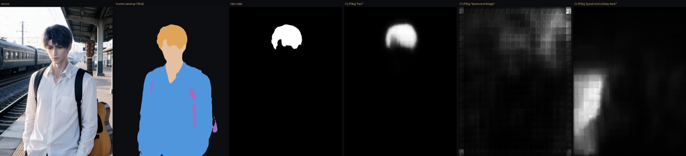
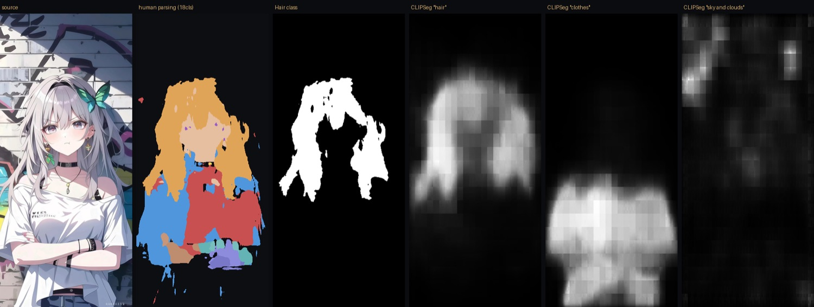
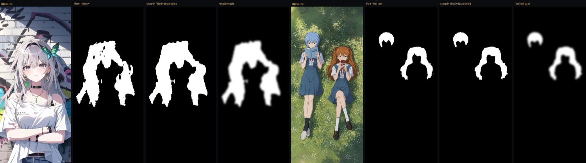
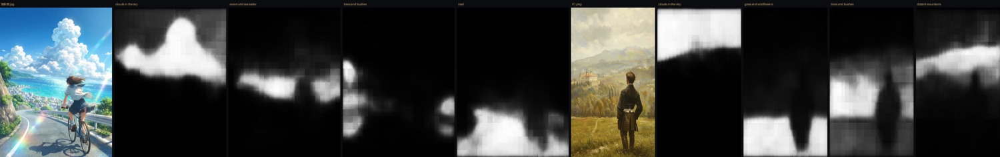

# 角色图微动效 · 技术调研

> 让静态角色图"活"起来：头发轻轻飘、布料微微起伏、空气里有缓慢的浮尘。
> 用于聊天背景常驻，所以幅度必须极小、构图必须完全静止、必须能无限循环。

### ▶ [打开可运行 Demo](https://claude.ai/code/artifact/29ae93c0-dd2d-4fd5-932e-214333869964)

右上角切换六张不同画风的测试图，拖动「位移幅度」和「发根锚定」两个滑杆，**按住画面可冻结对比原图**。
Demo 里所有闸门（"哪里该动"的区域）全部由模型自动生成，无一笔人工涂抹。

---

## 0. 结论

**方案跑通了，成本低到可以忽略，人工已经归零。**

每张图的增量成本是 **一个约 20KB 的权重图 + 约 300ms 的离线计算**，运行时开销接近于零（无 GPU 的纯软件渲染下仍有 100fps）。

**但六张测试图里只有三张达到预期。** 另外三张的问题不在"能不能检测到"，而在"检测到之后动得对不对"——头发没动、周围草在动、腿在扭曲。**这正是需要算法同学介入的地方：抠图精度和位置识别。**

现在的结论是"路线成立"，不是"可以上线"。

---

## 1. 为什么做

角色图作为聊天背景常驻在屏幕上。完全静止的图，用久了就很枯燥——用户会意识到自己在看一张图片，而不是在跟一个人说话。

微动效的作用是**提供沉浸感，不是提供视觉焦点**。它应该是那种"你说不清哪里在动，但就是感觉她在那"的东西。

这跟做酷炫动效是两件相反的事。**一切以不出戏为最高优先级。**

---

## 2. 目标与硬约束

| 约束 | 说明 |
| --- | --- |
| 构图绝对静止 | 不允许整图位移、缩放、镜头漂移 |
| 人脸绝对不动 | 五官任何形变都会立刻出戏 |
| 只动该动的 | 头发、衣领衣摆、树叶草地、云、浮尘。其余一律不动 |
| 无限循环 | 不能有接缝，不能有"重播"感 |
| 零人工 | 角色图是运行时生成的，不可能逐张标注 |

> **一条红线：宁可不动，也不能乱动。**
> 静止的图只是一张普通背景，用户不会觉得有问题；乱动的图（脸变形、背景飘、构图移位）是事故。所有取舍以此为准。

---

## 3. 技术路线全景

这一节记录**试过和排除的所有路线**，包括失败的。选型结论本身不如"为什么排除"有价值。

| # | 路线 | 验证程度 | 结论 |
| --- | --- | --- | --- |
| A | 生成式视频（即梦 Seedance） | 跑过 API | **排除** · 速度很慢且成本不成比例 |
| B | 开源生成式（LTX Cinemagraph / DreamLoop） | 桌面调研 | **排除** · 同属重方案 |
| C | 深度视差（DepthFlow） | 桌面调研 | **排除** · 方向与约束相反 |
| D | 纯 CV 全图权重（Sobel） | 实做 | **失败** · 无法调出可用区间 |
| E | 闸门式 + 人工涂抹 | 实做 | **可行但不扩展** |
| F | **闸门式 + 自动分割** | 实做 · 8 张实测 | **当前方案** |
| G | 分层抠图 + inpainting | 分析 | **暂缓** · 收益不抵成本 |

### A · 生成式视频

把角色图喂给视频生成模型，产出一段 5 秒循环 mp4。

实际动手做了：用即梦 CLI 的 `frames2video`，**把首帧和尾帧填同一张图**，用约束强制模型走闭环——普通 image2video 的尾帧一定会漂，循环时会跳一下。这个技巧本身是有效的，值得记下来。

**排除理由不是效果不好，是成本不成比例而且速度极慢，起码需要几分钟。** 为了 2px 的头发飘动去调 5 秒视频扩散模型：每张烧积分、等几分钟、结果抽卡不可控，产物 500KB–1MB（vs 现方案 20KB）。1000 个角色就是持续烧额度。

> **测试记录**：用即梦做了多段循环视频，视觉效果很赞，但首尾帧无法无缝循环且相应速度太慢。

### B · 开源生成式

[LTX-2.3 Cinemagraph LoRA](https://huggingface.co/Lightricks/LTX-2.3-22b-LoRA-Cinemagraph)（专门训 cinemagraph，局部动其余冻结）、[DreamLoop](https://arxiv.org/abs/2601.02646)。**只做了桌面调研，没有实跑。** 与 A 同属"用扩散模型解决一个几何问题"，一并排除。

### C · 深度视差

[DepthFlow](https://github.com/BrokenSource/DepthFlow) + Depth Anything V2，开源，明确支持无缝循环，质量不错。**没有实跑。**

排除理由很直接：它做的是**镜头视差**——整张图 2.5D 缓慢漂移。而我们的硬约束第一条就是构图绝对静止。**方向正好相反。**

### D · 纯 CV 全图权重 ✗ 失败

第一个真正动手的方案：用 Sobel 边缘密度当"可动性权重"。想法是头发丝、树叶天然是高频细节区，脸颊、天空天然是低频平坦区，所以高频=该动。

**失败了，而且是架构性的失败。**

问题在于全图都被赋予了一点权重，于是只有两种结果：幅度小到看不见，或者大到**整个火车站一起扭**。这不是调参能救的——碎石是高频，钢梁是高对比边缘，**高频细节 ≠ 该动**。

过程中还抓到一个反直觉的 bug：Sobel 算的是绝对梯度，**同样的纹理在亮区梯度天然大、暗区天然小**，导致白衬衫权重高于深色头发——跟需求正好相反。改成相对对比度（梯度 ÷ 局部平均亮度）后修复。这个修正保留在了当前方案里。

### E · 闸门式 + 人工涂抹

架构改造：**闸门决定"哪里动"，Sobel 只决定"动多少"。** 闸门默认全 0，不刷就完全静止。

这一改问题立刻消失——因为动效被关在小区域里，位移幅度可以放大到 5–7px 仍不出戏（此前 1.8px 就已经全图发糊）。

可行，但每张图要人刷 10–30 秒。**角色图是运行时生成的，这条路不成立。**

### F · 闸门式 + 自动分割 ← 当前方案

用**人像解析**替代人工涂抹。关键认知：不要做通用语义分割，用专门标注人体部位的模型，它**直接输出 `Hair` 类**。

- 角色：[SegFormer-B2 人像解析](https://huggingface.co/mattmdjaga/segformer_b2_clothes)（ATR 18 类）→ `Hair` / `Upper-clothes` / `Face`
- 景物：[CLIPSeg](https://huggingface.co/CIDAS/clipseg-rd64-refined) 文本提示分割 → 云、海、树、草

发根锚点由 `Hair` mask 顶端自动推出，衣领由 `Upper-clothes ∩ 膨胀(Face∪Hair)` 形态学得到，肤色保护由 `Face` 类替代原先的 YCbCr 色彩空间 hack。**全程无人工。**

模型自动推出的锚点 `(0.510, 0.117)`，与此前手工调的 `(0.500, 0.088)` 几乎重合。



**二次元需要两个额外修补**（详见第 6 节）：`Hair ∪ Hat` 合并，以及形态学清洗。

### G · 分层抠图 + inpainting

当前是 uv 位移，没有图层概念，**动前景必然蹭到背景**。彻底解法是把头发抠成独立 alpha 层。

**暂缓。** 抠出头发后，头发一动就露出它原本盖住的背景——空洞，所以必然带 inpainting，这才是真成本。而微幅位移下缝隙极窄，把背景边缘像素向外拉伸几像素就能糊过去。

它真正解决的只有"头发要大幅飘出轮廓"这一种需求。等确认微幅不够看了再上。

---

## 4. 运动质感的四次返工

选对了路线不等于做得像。以下四条都是"看起来应该对、实际一眼假"的坑，全部是实际发生的返工。

| # | 症状 | 根因 | 修法 |
| --- | --- | --- | --- |
| 1 | 整张图飘来飘去 | 加了 1.2% 镜头漂移 | 砍到 0，降级为可选滑杆 |
| 2 | 像热浪 / 水波扭曲，不像头发 | 流场空间频率 11–23 周期，是小尺度涟漪 | 降到 3–6 周期，整缕一起摆；横向位移为纵向 4 倍 |
| 3 | 中分线在左右摇摆 | 闸门衰减是 `1-d²`，**中心最强**，而头顶正好在中心 | 改为发根锚定：权重随"离发根距离"增长 |
| 4 | 像果冻，整块刚体摆动 | 全区域同相位 | 相位沿距离延迟，摆动**从发根往发梢传播** |

第 3、4 条是"像头发"和"像一团东西"的分界线。真实头发是发根固定、发梢自由，且摆动是**从根传到梢的波**。这两条只用了一张贴图通道和一个 uniform 就实现了。

---

## 5. 当前方案

```
角色图
 ├─→ 人像解析（Hair ∪ Hat / Upper-clothes / Face）
 ├─→ 形态学清洗（闭运算 → 填洞 → 连通域去碎块）
 ├─→ 锚点推导 + QA 判定        ← 纯几何，免费
 └─→ weight.png（约 20KB，随图缓存）
                    ↓
              端上 Shader        ← 每帧渲染，成本≈0
```

**闸门是每张图算一次的静态数据，不是每帧算。** 它跑在出图管线里——出图本来就要几秒，多 300ms 完全不可见。**运行时的分割开销是 0。**

### 循环为什么是无缝的

位移场是 `sin(ωt) + sin(2ωt) + sin(3ωt)` 形式的谐波叠加，频率全是基频整数倍，**所以它在数学上本来就是周期函数**。

不是"生成一段再想办法接上"，而是天然无限连续、永不重复感、永不接缝。粒子和光呼吸同理（整数圈 wrap）。这是相对生成式路线的结构性优势。

---

## 6. 实测数据

### 渲染侧

| 项 | 实测 |
| --- | --- |
| 运行时内核 | **204 行**（GLSL + JS，零依赖，不引 three/pixi） |
| 渲染开销 | **96–104 fps** — 纯软件光栅化（无 GPU）下的实测 |
| 权重图体积 | 1–19 KB（320px 长边灰度 PNG） |
| 资源增量 | **约 +15%**（相对本来就要下发的角色图） |
| 循环 | 数学严格周期，非首尾拼接 |

### 分割侧 · 六种画风有一半达到预期

| 测试图 | 画风 | 闸门覆盖 | 连通域 | QA |
| --- | --- | --- | --- | --- |
| 站台 | 半写实 AI 人像 | 4.02% | 1 | ✅ |
| 田野 | 油画 | 0.78% | 1 | ❌人物比较小，未发生变化 |
| 画室 | 3D 渲染 | 5.79% | 1 | ✅ |
| 正脸 | 二次元 · 平涂长发 | 17.14% | 1 | ✅ |
| 背影 | 二次元 · 新海诚风 | 0.68% | 1 | ❌识别到了人物的腿部在动 |
| 双人 | 二次元 · 两角色 | 5.27% | 2 | ❌人物头发没动，只有周围的草在动 |

批处理全流程（解析 + 清洗 + 锚点 + 编码）**190–310 ms/张**，冷启动首张 679ms。

> **⚠ 这张表最重要的一行是"QA 全部判 ok"。**
> 六张图的自动 QA（覆盖率、连通域数）全部通过，但人眼看只有一半达标。
> **说明当前 QA 规则和主观质量是脱节的**——它只能判断"有没有框到东西"，判断不了"框对了没有、动对了没有"。
> 这条比画风覆盖率更值得优先解决：一个判不准的 QA，比没有 QA 更危险，因为它会给出虚假的安全感。

### 三个 ❌ 的根因（已定位）

**都不是检测失败** —— mask 都正确框到了头发。问题出在框到之后的权重分布上。把权重图渲出来看，双人图里两个角色的**头发核心是暗的、外面一圈是亮的**，而那一圈正好落在草地上——这就是"头发没动、周围草在扭曲"的直接原因。

| | 缺陷 | 说明 |
| --- | --- | --- |
| **B1** | 锚点距离用全图欧氏距离，没约束在 mask 内 | 发根锚定让权重随"离发根距离"增长。但距离是在整张图上算的，不管有没有落在头发上，于是**闸门柔边的外圈（已经在背景上了）权重最高，发根反而被压到最低**。这一条同时解释了双人图的草地环、背影图的"腿在动"（柔边向下糊到了车身和腿）。 |
| **B2** | 多角色时锚点半径按全图 bbox 计算 | 双人图的作用半径横跨两个角色 → 半径过大 → 整体归一化距离偏小 → **头发权重被整体压到最低档**。锚点必须按连通域逐个计算。 |

**修法方向**：距离场应改为**在 mask 内部的测地距离**（约束在头发区域里传播），而不是全图欧氏距离；锚点与半径按连通域独立推导。这属于"位置识别"范畴，正是算法同学要接手的部分。

田野那张的 ❌ 是另一个原因：人物占比太小（闸门覆盖 0.78%），绝对像素量不足以产生可见位移，需要按人物尺寸自适应幅度。



### 二次元的两个必要修补

**`Hair ∪ Hat`** — 平涂纯色短发会被模型判成帽子。双人图里绫波丽的蓝色短发就是这个 case（`Hat: 0.67%`），整个人的头发几乎全漏。合并后完全修复，对写实图无副作用。

**形态学清洗** — 二次元原始 mask 内部有大量破洞和碎块，直接用会出现"有的发片动、有的不动"的斑驳感，比不动还出戏。闭运算 → 填洞 → 连通域去碎块，320px 上跑 160ms。



### 景物元素

用文本提示分割跑了 8 个词，**空间位置全部正确**，一个没跑偏：云团、海面、崖边植被、公路、天空带、草地花田、树线、远山。**4 个提示词一次推理 77ms。**



输出原生只有 352×352，块状感明显——但闸门本来就要模糊到 320px，**从这轮结果看精度够用**。

---

## 7. 成本账

| | 本方案 | 生成式路线（对照） |
| --- | --- | --- |
| 每张图 | 20KB 资源 + 约 300ms 离线计算 | 几十积分 + 数分钟等待 |
| 产物体积 | 20 KB 权重图 | 500KB–1MB 视频 |
| 人工 | **0** | 0（但结果抽卡） |
| 运行时 | 0 额外请求，1 个 shader pass | 视频解码 |
| 循环 | 数学严格无缝 | 需靠首尾同帧凑 |
| 可控性 | 参数实时可调 | 抽卡 |
| 扩到 1000 张 | 约 5 分钟机器时间 | 持续烧额度 |

**唯一真金白银的开销是手机功耗**——全屏 shader 每帧重绘。三个措施基本能抹平：锁 30fps、聊天不活跃时暂停、尊重系统「减少动态」设置。但这部分**目前零实测数据**。

---

## 8. 风险与未验证

> **下一步需要扩大样本并引入算法规则来精细化调整。**

- **画风覆盖不全** — 已测：半写实 / 油画 / 3D 渲染 / 三种二次元。**未测**：平涂线稿、漫画分镜、厚涂、像素风、水墨。
- **构图覆盖不全** — 未测：大头特写、多人（>2）、严重遮挡、角色占比极小。
- **移动端完全没测** — 帧率、耗电、发热、低端机降级
- **景物只验证了检测，没验证运动** — 找云 / 海 / 草的位置是准的，但**云该怎么飘、浪该怎么走，目前没开始调整**。现有渲染内核只有"发根锚定摆动"一种运动模型，对云（无锚定、周期长 5–10 倍）和海浪（定向行波）都不适用。
- **QA 有已知盲区** — 纯风景图无角色 → 覆盖率≈0 → 被判低置信 → **静默关闭动效**。而纯风景图恰恰最该有动效。需要修。
- **无用户侧验证** — "有沉浸感"目前是团队几个人的主观判断，没做过盲测。

---

## 9. 下一步与资源需求

算法同学已到位。建议按「哪里动」/「怎么动」切分，中间用固定的 `weight.png + meta.json` 契约对接，**两边可以完全并行**。

**优先级建议：**

1. **大规模通过率定标** — 拿 200–500 张真实角色图跑批处理，统计自动通过率，用数据重新定 QA 阈值。脚本已就绪，接上图集就能跑。**这个数字决定能否全量铺开，在它出来之前其他优化都是盲目投入。**
2. **修 QA 风景图盲区** — 几十行的事，但不修的话所有景物工作在端上都看不到效果。
3. **移动端实机功耗** — 唯一的运行时真实成本，越早知道越好。
4. 景物运动模型（云、树叶）→ 二次元 mask 质量 → 其余。

**需要的资源：**

- 真实角色图集 200–500 张（覆盖实际画风分布，不要挑好的）
- 一台中端IOS/安卓机用于功耗实测
- 出图管线里把 prompt 的景物名词抽成结构化字段——**这是我们独有的信息优势**：我们的图是实时生成，本身自带信息，直接喂给文本提示分割命中率高得多

---

## 附 · 资产清单

| 内容 | 位置 |
| --- | --- |
| 可运行原型（六图切换） | `微动效原型/v6_六图切换_全自动.html` · 自包含单文件，双击即开 |
| 历史版本 | `v4_手工闸门_基线.html`（人工闸门）、`v5_自动闸门_segformer.html` |
| 算法需求说明 | `微动效原型/需求说明.html` · 给算法同学的详细版，含接口契约 |
| 批处理脚本 | `build_pack.py` — 输入文件夹，输出闸门 + meta + QA 报告 |
| 画风测试脚本 | `seg_test.py` / `seg_test_anime.py` / `scenery_test.py` |
| 形态学清洗 | `clean_gate.py` — 无 scipy 依赖版本 |
| 分割对比图 | `微动效原型/分割测试/` — 9 张并排 montage |

---
